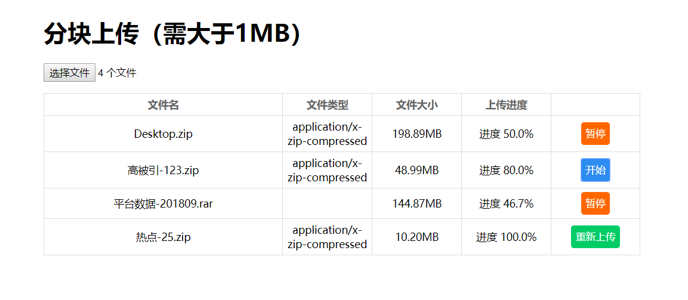

## 文件续传

和断点下载思路相同。

优势：网络中断情况下，下次网络恢复时，可从中断处继续上传/下载。也可手动暂停上传/下载。



### 断点下载

* Range请求头：指定请求实体范围，取值范围0-Content-Length之间

* 206状态码：表示范围请求成功

主要使用http的范围请求，首先获取目标文件的大小，然后将其拆分，设置Range请求头相应的取值。分段请求目标文件，然后将这些目标文件合并

### 文件续传

和断点下载反过来即可，客户端负责拆分文件，然后依次向服务端请求，服务端将传来的文件拼接成一个大文件

* 首先会判断本地localStorage是否有该文件的数据，如果有，则直接修改DOM，从中断处继续上传

* 然后会判断文件修改时间，如果文件有改动，会重新上传

* 根据localStorage中的分段信息，确定当前段号，以及使用slice分割文件

* 中间使用async/await控制每一段按顺序传（并不是好的策略），后面会将其直接异步将所有片段直接发给服务端，通过标识组合文件

* 服务端将客户端传来的文件存入tmp文件下，当文件传完将其删除

* 服务端根据客户端传来的信息，确定文件传输完毕，使用appendFileSync组合文件

```js
// localStorage存储的文件信息
logContent = {
  lastModified: file.lastModified,
  fileName: file.name,
  contentLength: file.size,
  blocks: blist,
  pointer: 0
};
```